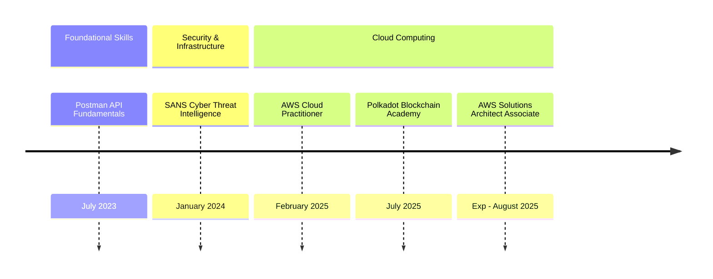

<h1 align="center">Hi 👋, I'm Sara</h1>

## 🛠 &nbsp;Tech Stack

<table align="center">
    <tr>
      <td>
            <!-- Programming Languages -->
            &nbsp;
            &nbsp;
            &nbsp;
            &nbsp;
            &nbsp;
            &nbsp;
            &nbsp; 
            &nbsp;
            &nbsp;
            &nbsp;
            &nbsp;
            &nbsp;
            &nbsp;
            &nbsp; 
            &nbsp;
            &nbsp;
            &nbsp;
            &nbsp;
            &nbsp; 
            &nbsp;
            &nbsp;
            &nbsp;
            &nbsp; 
            &nbsp;
            &nbsp;
            &nbsp; 
            &nbsp;
            &nbsp;
            &nbsp;
        </td>
        <td>
          
          
        </td>
    </tr>
</table>

## 🔥 &nbsp;Streak Stats
<td>
  

          
          
        </td>
 

## 🏆 &nbsp;Certifications

## 🤝🏻 &nbsp;Connect with Me

