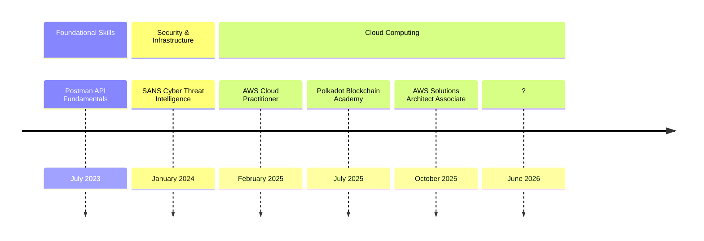

<!--Source: https://readme-typing-svg.demolab.com/demo/-->

    

    

## 🛠 &nbsp;Tech Stack

<table border="0" cellspacing="0" cellpadding="8">
  <tr>
    <td><strong>💻 Languages</strong></td>
    <td>
      
      
      
      
      
      
      
      
    </td>
  </tr>
<tr>
    <td><strong>☁️ Cloud Platforms</strong></td>
    <td>
      
      
      
      
      
      
    </td>
  </tr>
  <tr>
    <td><strong>🛠 Infrastructure & DevOps</strong></td>
    <td>
      
      
      
      
      
      
    </td>
  </tr>
  <tr>
    <td><strong>📊 Observability</strong></td>
    <td>
      
      
    </td>
  </tr>
  <tr>
    <td><strong>🤖 Data & ML</strong></td>
    <td>
      
      
      
      
      
      
      
    </td>
  </tr>
  <tr>
    <td><strong>🌐 Web & Databases</strong></td>
    <td>
      
      
      
      
      
      
    </td>
  </tr>
  <tr>
    <td><strong>🔧 Tooling</strong></td>
    <td>
      
      
      
      
    </td>
  </tr>
</table>

## 🔥 &nbsp;Streak Stats

  
  

## 🏆 &nbsp;Certifications

```mermaid
timeline
    title 
    section Foundational Skills
        Postman API Fundamentals : July 2023
    section Security & Infrastructure
        SANS Cyber Threat Intelligence : January 2024
    section Cloud Computing
        AWS Cloud Practitioner : February 2025
        Polkadot Blockchain Academy : July 2025
        AWS Solutions Architect Associate : October 2025
        ? : June 2026
```

## 🤝🏻 &nbsp;Connect with Me

